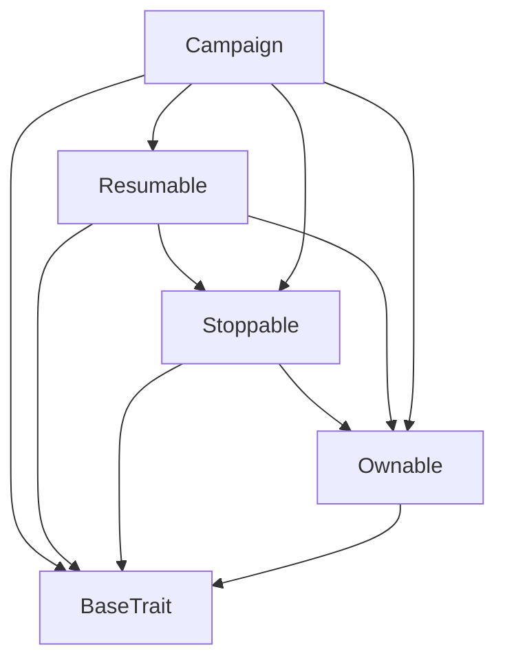

# TACT Compilation Report
Contract: Campaign
BOC Size: 11265 bytes

# Types
Total Types: 61

## StateInit
TLB: `_ code:^cell data:^cell = StateInit`
Signature: `StateInit{code:^cell,data:^cell}`

## StdAddress
TLB: `_ workchain:int8 address:uint256 = StdAddress`
Signature: `StdAddress{workchain:int8,address:uint256}`

## VarAddress
TLB: `_ workchain:int32 address:^slice = VarAddress`
Signature: `VarAddress{workchain:int32,address:^slice}`

## Context
TLB: `_ bounced:bool sender:address value:int257 raw:^slice = Context`
Signature: `Context{bounced:bool,sender:address,value:int257,raw:^slice}`

## SendParameters
TLB: `_ bounce:bool to:address value:int257 mode:int257 body:Maybe ^cell code:Maybe ^cell data:Maybe ^cell = SendParameters`
Signature: `SendParameters{bounce:bool,to:address,value:int257,mode:int257,body:Maybe ^cell,code:Maybe ^cell,data:Maybe ^cell}`

## ChangeOwner
TLB: `change_owner#819dbe99 queryId:uint64 newOwner:address = ChangeOwner`
Signature: `ChangeOwner{queryId:uint64,newOwner:address}`

## ChangeOwnerOk
TLB: `change_owner_ok#327b2b4a queryId:uint64 newOwner:address = ChangeOwnerOk`
Signature: `ChangeOwnerOk{queryId:uint64,newOwner:address}`

## Deploy
TLB: `deploy#946a98b6 queryId:uint64 = Deploy`
Signature: `Deploy{queryId:uint64}`

## DeployOk
TLB: `deploy_ok#aff90f57 queryId:uint64 = DeployOk`
Signature: `DeployOk{queryId:uint64}`

## FactoryDeploy
TLB: `factory_deploy#6d0ff13b queryId:uint64 cashback:address = FactoryDeploy`
Signature: `FactoryDeploy{queryId:uint64,cashback:address}`

## AdminWithdraw
TLB: `admin_withdraw#018fcaea amount:coins wallets:dict<address, bool> = AdminWithdraw`
Signature: `AdminWithdraw{amount:coins,wallets:dict<address, bool>}`

## AdminUpdateFeeBalance
TLB: `admin_update_fee_balance#a20a4d3d advertiserFeePercentage:uint32 affiliateFeePercentage:uint32 = AdminUpdateFeeBalance`
Signature: `AdminUpdateFeeBalance{advertiserFeePercentage:uint32,affiliateFeePercentage:uint32}`

## AdminReplenish
TLB: `admin_replenish#0383ae5d  = AdminReplenish`
Signature: `AdminReplenish{}`

## AdminModifyCampaignFeePercentage
TLB: `admin_modify_campaign_fee_percentage#42926596 campaignId:uint32 advertiser:address feePercentage:uint32 = AdminModifyCampaignFeePercentage`
Signature: `AdminModifyCampaignFeePercentage{campaignId:uint32,advertiser:address,feePercentage:uint32}`

## AdminStopCampaign
TLB: `admin_stop_campaign#6ca32924 campaignId:uint32 advertiser:address = AdminStopCampaign`
Signature: `AdminStopCampaign{campaignId:uint32,advertiser:address}`

## AdminResumeCampaign
TLB: `admin_resume_campaign#1b6d7920 campaignId:uint32 advertiser:address = AdminResumeCampaign`
Signature: `AdminResumeCampaign{campaignId:uint32,advertiser:address}`

## AdminSeizeCampaignBalance
TLB: `admin_seize_campaign_balance#556d66cb campaignId:uint32 advertiser:address = AdminSeizeCampaignBalance`
Signature: `AdminSeizeCampaignBalance{campaignId:uint32,advertiser:address}`

## AdminJettonNotificationMessageFailure
TLB: `admin_jetton_notification_message_failure#e0ac595f campaignId:uint32 advertiser:address amount:coins = AdminJettonNotificationMessageFailure`
Signature: `AdminJettonNotificationMessageFailure{campaignId:uint32,advertiser:address,amount:coins}`

## AdminWithdrawUSDTToPayout
TLB: `admin_withdraw_usdt_to_payout#a125f422 campaignId:uint32 advertiser:address amount:coins = AdminWithdrawUSDTToPayout`
Signature: `AdminWithdrawUSDTToPayout{campaignId:uint32,advertiser:address,amount:coins}`

## AdminPayAffiliateUSDTBounced
TLB: `admin_pay_affiliate_usdt_bounced#568c4eb6 campaignId:uint32 advertiser:address affiliateId:uint64 amount:coins = AdminPayAffiliateUSDTBounced`
Signature: `AdminPayAffiliateUSDTBounced{campaignId:uint32,advertiser:address,affiliateId:uint64,amount:coins}`

## AdvertiserWithdrawFundsEvent
TLB: `advertiser_withdraw_funds_event#d3be1436 campaignId:uint32 advertiser:address amount:coins = AdvertiserWithdrawFundsEvent`
Signature: `AdvertiserWithdrawFundsEvent{campaignId:uint32,advertiser:address,amount:coins}`

## CampaignCreatedEvent
TLB: `campaign_created_event#922a4ab1 campaignId:uint32 advertiser:address campaignContractAddress:address = CampaignCreatedEvent`
Signature: `CampaignCreatedEvent{campaignId:uint32,advertiser:address,campaignContractAddress:address}`

## AdvertiserSignedCampaignDetailsEvent
TLB: `advertiser_signed_campaign_details_event#5b24a297 campaignId:uint32 advertiser:address = AdvertiserSignedCampaignDetailsEvent`
Signature: `AdvertiserSignedCampaignDetailsEvent{campaignId:uint32,advertiser:address}`

## AffiliateCreatedEvent
TLB: `affiliate_created_event#8720b559 campaignId:uint32 advertiser:address affiliateId:uint32 affiliate:address state:uint8 = AffiliateCreatedEvent`
Signature: `AffiliateCreatedEvent{campaignId:uint32,advertiser:address,affiliateId:uint32,affiliate:address,state:uint8}`

## AdvertiserRemovedAffiliateEvent
TLB: `advertiser_removed_affiliate_event#5b37cc4f campaignId:uint32 advertiser:address affiliateId:uint32 affiliate:address = AdvertiserRemovedAffiliateEvent`
Signature: `AdvertiserRemovedAffiliateEvent{campaignId:uint32,advertiser:address,affiliateId:uint32,affiliate:address}`

## AdvertiserApprovedAffiliateListEvent
TLB: `advertiser_approved_affiliate_list_event#f4f5a2d1 campaignId:uint32 advertiser:address affiliateId:uint32 affiliate:address = AdvertiserApprovedAffiliateListEvent`
Signature: `AdvertiserApprovedAffiliateListEvent{campaignId:uint32,advertiser:address,affiliateId:uint32,affiliate:address}`

## AdvertiserDeployNewCampaign
TLB: `advertiser_deploy_new_campaign#46500c1f  = AdvertiserDeployNewCampaign`
Signature: `AdvertiserDeployNewCampaign{}`

## ParentToChildDeployCampaign
TLB: `parent_to_child_deploy_campaign#4d0a40dc campaignId:uint32 advertiser:address = ParentToChildDeployCampaign`
Signature: `ParentToChildDeployCampaign{campaignId:uint32,advertiser:address}`

## ParentToChildUpdateFeePercentage
TLB: `parent_to_child_update_fee_percentage#7a2f577d feePercentage:uint32 = ParentToChildUpdateFeePercentage`
Signature: `ParentToChildUpdateFeePercentage{feePercentage:uint32}`

## ParentToChildSeizeCampaign
TLB: `parent_to_child_seize_campaign#144d136b  = ParentToChildSeizeCampaign`
Signature: `ParentToChildSeizeCampaign{}`

## ParentToChildJettonNotificationMessageFailure
TLB: `parent_to_child_jetton_notification_message_failure#50c09c85 amount:coins = ParentToChildJettonNotificationMessageFailure`
Signature: `ParentToChildJettonNotificationMessageFailure{amount:coins}`

## ParentToChildWithdrawUSDTToPayout
TLB: `parent_to_child_withdraw_usdt_to_payout#850b9dad amount:coins = ParentToChildWithdrawUSDTToPayout`
Signature: `ParentToChildWithdrawUSDTToPayout{amount:coins}`

## ParentToChildPayAffiliateUSDTBounced
TLB: `parent_to_child_pay_affiliate_usdt_bounced#9a795876 affiliateId:uint64 amount:coins = ParentToChildPayAffiliateUSDTBounced`
Signature: `ParentToChildPayAffiliateUSDTBounced{affiliateId:uint64,amount:coins}`

## BotUserAction
TLB: `bot_user_action#73aa5689 affiliateId:uint32 userActionOpCode:uint32 isPremiumUser:bool = BotUserAction`
Signature: `BotUserAction{affiliateId:uint32,userActionOpCode:uint32,isPremiumUser:bool}`

## PayAffiliate
TLB: `pay_affiliate#89b9d2c2 affiliateId:uint32 amount:coins = PayAffiliate`
Signature: `PayAffiliate{affiliateId:uint32,amount:coins}`

## AffiliateCreateNewAffiliate
TLB: `affiliate_create_new_affiliate#30e4a900  = AffiliateCreateNewAffiliate`
Signature: `AffiliateCreateNewAffiliate{}`

## AffiliateWithdrawEarnings
TLB: `affiliate_withdraw_earnings#89a71de6 affiliateId:uint32 = AffiliateWithdrawEarnings`
Signature: `AffiliateWithdrawEarnings{affiliateId:uint32}`

## AdvertiserWithdrawFunds
TLB: `advertiser_withdraw_funds#d55442e1 amount:coins = AdvertiserWithdrawFunds`
Signature: `AdvertiserWithdrawFunds{amount:coins}`

## AdvertiserAddNewUserOpCode
TLB: `advertiser_add_new_user_op_code#0e274d0e userOpCode:uint32 isPremiumUserOpCode:bool costPerAction:coins = AdvertiserAddNewUserOpCode`
Signature: `AdvertiserAddNewUserOpCode{userOpCode:uint32,isPremiumUserOpCode:bool,costPerAction:coins}`

## AdvertiserSetCampaignDetails
TLB: `advertiser_set_campaign_details#4ab09b48 campaignDetails:CampaignDetails{regularUsersCostPerAction:dict<int, int>,premiumUsersCostPerAction:dict<int, int>,isPublicCampaign:bool,campaignValidForNumDays:Maybe uint32,paymentMethod:uint32,requiresAdvertiserApprovalForWithdrawl:bool} = AdvertiserSetCampaignDetails`
Signature: `AdvertiserSetCampaignDetails{campaignDetails:CampaignDetails{regularUsersCostPerAction:dict<int, int>,premiumUsersCostPerAction:dict<int, int>,isPublicCampaign:bool,campaignValidForNumDays:Maybe uint32,paymentMethod:uint32,requiresAdvertiserApprovalForWithdrawl:bool}}`

## AdvertiserUserAction
TLB: `advertiser_user_action#c09bd809 affiliateId:uint32 userActionOpCode:uint32 isPremiumUser:bool = AdvertiserUserAction`
Signature: `AdvertiserUserAction{affiliateId:uint32,userActionOpCode:uint32,isPremiumUser:bool}`

## AdvertiserRemoveAffiliate
TLB: `advertiser_remove_affiliate#9d2ede51 affiliateId:uint32 = AdvertiserRemoveAffiliate`
Signature: `AdvertiserRemoveAffiliate{affiliateId:uint32}`

## AdvertiserApproveAffiliate
TLB: `advertiser_approve_affiliate#5d0468dc affiliateId:uint32 = AdvertiserApproveAffiliate`
Signature: `AdvertiserApproveAffiliate{affiliateId:uint32}`

## AdvertiserReplenish
TLB: `advertiser_replenish#4ea440b6  = AdvertiserReplenish`
Signature: `AdvertiserReplenish{}`

## AdvertiserReplenishGasFeesForUSDTCampaign
TLB: `advertiser_replenish_gas_fees_for_usdt_campaign#bcf6870a  = AdvertiserReplenishGasFeesForUSDTCampaign`
Signature: `AdvertiserReplenishGasFeesForUSDTCampaign{}`

## AdvertiserSignOffWithdraw
TLB: `advertiser_sign_off_withdraw#932f8050 setAffiliatesWithdrawEarnings:dict<int, int> = AdvertiserSignOffWithdraw`
Signature: `AdvertiserSignOffWithdraw{setAffiliatesWithdrawEarnings:dict<int, int>}`

## ChildToParentCampaignDeployedSuccessfully
TLB: `child_to_parent_campaign_deployed_successfully#16193574 campaignId:uint32 advertiser:address = ChildToParentCampaignDeployedSuccessfully`
Signature: `ChildToParentCampaignDeployedSuccessfully{campaignId:uint32,advertiser:address}`

## ChildToParentAffiliateCreated
TLB: `child_to_parent_affiliate_created#cf499d89 campaignId:uint32 affiliateId:uint32 advertiser:address affiliate:address state:uint8 = ChildToParentAffiliateCreated`
Signature: `ChildToParentAffiliateCreated{campaignId:uint32,affiliateId:uint32,advertiser:address,affiliate:address,state:uint8}`

## ChildToParentAdvertiserSignedCampaignDetails
TLB: `child_to_parent_advertiser_signed_campaign_details#4a709d19 campaignId:uint32 advertiser:address = ChildToParentAdvertiserSignedCampaignDetails`
Signature: `ChildToParentAdvertiserSignedCampaignDetails{campaignId:uint32,advertiser:address}`

## ChildToParentAdvertiserWithdrawFunds
TLB: `child_to_parent_advertiser_withdraw_funds#9a091c00 campaignId:uint32 advertiser:address amount:coins = ChildToParentAdvertiserWithdrawFunds`
Signature: `ChildToParentAdvertiserWithdrawFunds{campaignId:uint32,advertiser:address,amount:coins}`

## ChildToParentAdvertiserApprovedAffiliate
TLB: `child_to_parent_advertiser_approved_affiliate#594d3e26 campaignId:uint32 advertiser:address affiliateId:uint32 affiliate:address = ChildToParentAdvertiserApprovedAffiliate`
Signature: `ChildToParentAdvertiserApprovedAffiliate{campaignId:uint32,advertiser:address,affiliateId:uint32,affiliate:address}`

## ChildToParentAdvertiserRemovedAffiliate
TLB: `child_to_parent_advertiser_removed_affiliate#829096ae campaignId:uint32 advertiser:address affiliateId:uint32 affiliate:address = ChildToParentAdvertiserRemovedAffiliate`
Signature: `ChildToParentAdvertiserRemovedAffiliate{campaignId:uint32,advertiser:address,affiliateId:uint32,affiliate:address}`

## JettonTransferNotification
TLB: `jetton_transfer_notification#7362d09c queryId:uint64 amount:coins sender:address forwardPayload:remainder<slice> = JettonTransferNotification`
Signature: `JettonTransferNotification{queryId:uint64,amount:coins,sender:address,forwardPayload:remainder<slice>}`

## TokenExcesses
TLB: `token_excesses#d53276db query_id:uint64 = TokenExcesses`
Signature: `TokenExcesses{query_id:uint64}`

## CampaignDetails
TLB: `_ regularUsersCostPerAction:dict<int, int> premiumUsersCostPerAction:dict<int, int> isPublicCampaign:bool campaignValidForNumDays:Maybe uint32 paymentMethod:uint32 requiresAdvertiserApprovalForWithdrawl:bool = CampaignDetails`
Signature: `CampaignDetails{regularUsersCostPerAction:dict<int, int>,premiumUsersCostPerAction:dict<int, int>,isPublicCampaign:bool,campaignValidForNumDays:Maybe uint32,paymentMethod:uint32,requiresAdvertiserApprovalForWithdrawl:bool}`

## UserActionStats
TLB: `_ numActions:uint32 lastUserActionTimestamp:uint32 = UserActionStats`
Signature: `UserActionStats{numActions:uint32,lastUserActionTimestamp:uint32}`

## AffiliateData
TLB: `_ affiliate:address state:uint8 userActionsStats:dict<int, ^UserActionStats{numActions:uint32,lastUserActionTimestamp:uint32}> premiumUserActionsStats:dict<int, ^UserActionStats{numActions:uint32,lastUserActionTimestamp:uint32}> pendingApprovalEarnings:coins totalEarnings:coins withdrawEarnings:coins = AffiliateData`
Signature: `AffiliateData{affiliate:address,state:uint8,userActionsStats:dict<int, ^UserActionStats{numActions:uint32,lastUserActionTimestamp:uint32}>,premiumUserActionsStats:dict<int, ^UserActionStats{numActions:uint32,lastUserActionTimestamp:uint32}>,pendingApprovalEarnings:coins,totalEarnings:coins,withdrawEarnings:coins}`

## CampaignData
TLB: `_ campaignId:uint32 advertiser:address owner:address payout:address campaignDetails:CampaignDetails{regularUsersCostPerAction:dict<int, int>,premiumUsersCostPerAction:dict<int, int>,isPublicCampaign:bool,campaignValidForNumDays:Maybe uint32,paymentMethod:uint32,requiresAdvertiserApprovalForWithdrawl:bool} numAffiliates:uint32 totalAffiliateEarnings:coins state:uint32 campaignStartTimestamp:uint32 lastUserActionTimestamp:uint32 numAdvertiserWithdrawls:uint32 numAdvertiserSignOffs:uint32 numAdvertiserReplenishCampaign:uint32 numAdvertiserReplenishGasFees:uint32 numUserActions:uint32 campaignBalance:coins maxCpaValue:coins contractTonBalance:coins contractAddress:address contractUSDTBalance:coins contractUsdtWallet:address advertiserFeePercentage:uint32 affiliateFeePercentage:uint32 campaignHasSufficientFundsToPayMaxCpa:bool isCampaignExpired:bool isCampaignPausedByAdmin:bool campaignHasSufficientTonToPayGasFees:bool isCampaignActive:bool topAffiliates:dict<int, int> = CampaignData`
Signature: `CampaignData{campaignId:uint32,advertiser:address,owner:address,payout:address,campaignDetails:CampaignDetails{regularUsersCostPerAction:dict<int, int>,premiumUsersCostPerAction:dict<int, int>,isPublicCampaign:bool,campaignValidForNumDays:Maybe uint32,paymentMethod:uint32,requiresAdvertiserApprovalForWithdrawl:bool},numAffiliates:uint32,totalAffiliateEarnings:coins,state:uint32,campaignStartTimestamp:uint32,lastUserActionTimestamp:uint32,numAdvertiserWithdrawls:uint32,numAdvertiserSignOffs:uint32,numAdvertiserReplenishCampaign:uint32,numAdvertiserReplenishGasFees:uint32,numUserActions:uint32,campaignBalance:coins,maxCpaValue:coins,contractTonBalance:coins,contractAddress:address,contractUSDTBalance:coins,contractUsdtWallet:address,advertiserFeePercentage:uint32,affiliateFeePercentage:uint32,campaignHasSufficientFundsToPayMaxCpa:bool,isCampaignExpired:bool,isCampaignPausedByAdmin:bool,campaignHasSufficientTonToPayGasFees:bool,isCampaignActive:bool,topAffiliates:dict<int, int>}`

## JettonWalletData
TLB: `_ status:uint4 balance:coins ownerAddress:address jettonMasterAddress:address = JettonWalletData`
Signature: `JettonWalletData{status:uint4,balance:coins,ownerAddress:address,jettonMasterAddress:address}`

## Campaign$Data
TLB: `null`
Signature: `null`

## AffiliateMarketplace$Data
TLB: `null`
Signature: `null`

# Get Methods
Total Get Methods: 7

## campaignData

## affiliateData
Argument: affiliateId

## affiliatesData

## affiliatesDataInRange
Argument: fromIdx
Argument: toIdx

## balance

## stopped

## owner

# Error Codes
2: Stack underflow
3: Stack overflow
4: Integer overflow
5: Integer out of expected range
6: Invalid opcode
7: Type check error
8: Cell overflow
9: Cell underflow
10: Dictionary error
11: 'Unknown' error
12: Fatal error
13: Out of gas error
14: Virtualization error
32: Action list is invalid
33: Action list is too long
34: Action is invalid or not supported
35: Invalid source address in outbound message
36: Invalid destination address in outbound message
37: Not enough TON
38: Not enough extra-currencies
39: Outbound message does not fit into a cell after rewriting
40: Cannot process a message
41: Library reference is null
42: Library change action error
43: Exceeded maximum number of cells in the library or the maximum depth of the Merkle tree
50: Account state size exceeded limits
128: Null reference exception
129: Invalid serialization prefix
130: Invalid incoming message
131: Constraints error
132: Access denied
133: Contract stopped
134: Invalid argument
135: Code of a contract was not found
136: Invalid address
137: Masterchain support is not enabled for this contract
1919: Insufficient USDT funds to make transfer
2272: Only USDT Campaigns can accept excess TON
2509: Must have at least one wallet to withdraw to
5136: Only TON or USDT supported as payment methods
7354: Bot can verify only op codes under 20000
8805: Insufficient funds to create affiliate
9125: withdrawableAmount must be <= pendingApprovalEarnings
10630: Must withdraw a positive amount
11661: Only advertiser can verify these events
12734: Can only add op codes
12969: Must be in state: STATE_CAMPAIGN_DETAILS_SET_BY_ADVERTISER
14465: Advertiser can verify only op codes over 20000
14486: Cannot find cpa for the given op code
19587: Only the advertiser can remove an existing affiliate
20411: Insufficient contract funds to repay bot
22985: Insufficient campaign funds
24142: Campaign is not active
26205: Only USDT Campaigns can accept USDT
26953: Only affiliate can withdraw funds
27356: Only advertiser can add user op codes
28586: Advertiser can only modify affiliate earnings only if campaign is setup this requiresApprovalForWithdrawlFlag
32702: Affiliate in ACTIVE state
36363: Only the advertiser can remove the campaign and withdraw all funds
40368: Contract stopped
40466: Insufficient funds to deploy new campaign
40755: Only advertiser can send tokens to this contract
42372: Only bot can invoke this function
43069: Cannot manually add affiliates to an public campaign
43147: Inactive affiliate
44215: Invalid indices
45028: Insufficient gas fees to withdraw earnings
46629: Reached max number of affiliates for this campaign
48069: Affiliate does not exist for this id
48874: Insufficient contract funds to make payment
49469: Access denied
50865: owner must be deployer
53205: Only the advertiser can replenish the contract
53296: Contract not stopped
53456: Affiliate does not exist
57313: Must be in state: STATE_CAMPAIGN_CREATED
57567: Only advertiser can set campaign details
59035: Only contract wallet allowed to invoke
60504: Can replenish TON for gas fees for USDT camapigns only
63944: Invalid campaignValidForNumDays param

# Trait Inheritance Diagram

# Contract Dependency Diagram

